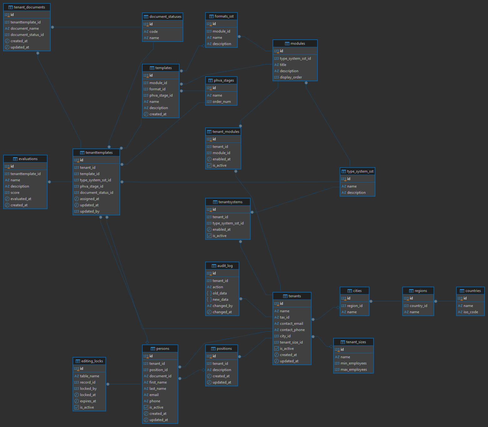
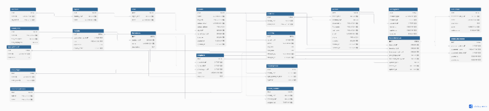

# Sistema de Gestión Multi-Tenant SST y PESV — PostgreSQL


## Información del Proyecto
- **Estudiante:** Diego Mantilla

---

## 1. Introducción al Proyecto

Las organizaciones modernas requieren plataformas tecnológicas estructuradas para administrar los procesos asociados a la **Seguridad y Salud en el Trabajo (SST)** y el **Plan Estratégico de Seguridad Vial (PESV)**. El manejo de esta información mediante hojas de cálculo o archivos aislados genera desorganización, pérdida de trazabilidad e incapacidad de evaluar el cumplimiento legal.

Para resolver esta problemática, el presente proyecto diseña e implementa una base de datos relacional robusta, escalable y normalizada bajo un modelo **multi-tenant**. Este modelo permite que múltiples empresas cliente compartan la misma infraestructura de datos manteniendo un **aislamiento lógico estricto**, garantizando la privacidad e integridad de los datos de cada organización.

---

## 2. Resumen del Trabajo Realizado

* **Diseño del Modelo Físico (20 Tablas):** Estructura relacional completa que abarca geografía, empresas, personal, módulos SST/PESV, formatos, plantillas, evaluaciones, bloqueos de concurrencia y auditoría `JSONB`.
* **Normalización Estricta (3FN):** Desacople total de redundancias, eliminación de dependencias parciales mediante tablas puente y estructuración jerárquica de ubicaciones (`countries` $\rightarrow$ `regions` $\rightarrow$ `cities`).
* **Contenedorización con Docker:** Despliegue automatizado del servidor PostgreSQL 16 y pgAdmin 4 con carga automática del esquema y semillas de prueba.
* **Documentación de Arquitectura:** Elaboración del manual técnico en [docs/guide.md](./docs/guide.md).

---

## 3. Diagramas Entidad-Relación

### 3.1 Diagrama de Estructura Relacional (DrawSQL)



### 3.2 Diagrama Entidad-Relación Completo (20 Tablas - dbdiagram)



---

## 4. Índice de Documentación Técnica

Toda la especificación técnica detallada, el proceso de normalización paso a paso, el diccionario de datos y las instrucciones de instalación se encuentran disponibles en la carpeta `docs/`:

* **[Guía de Arquitectura e Implementación (docs/guide.md)](./docs/guide.md)**
* **[Guía de Instalación e Inicio Rápido (docs/installation.md)](./docs/installation.md)**

---

## 5. Instrucciones Rápidas de Ejecución

```bash
# Levantar PostgreSQL + pgAdmin 4 en Docker
docker compose up -d

# Conectarse a psql en el contenedor
docker exec -it sst_pesv_pg psql -U sst_admin -d sst_pesv_db

# pgAdmin 4 Web Interface
# URL: http://localhost:8080 (admin@admin.com / admin)
```
